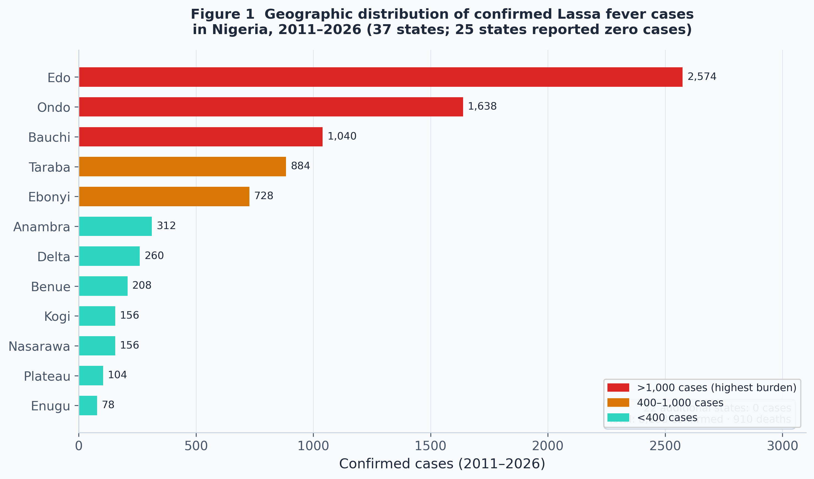
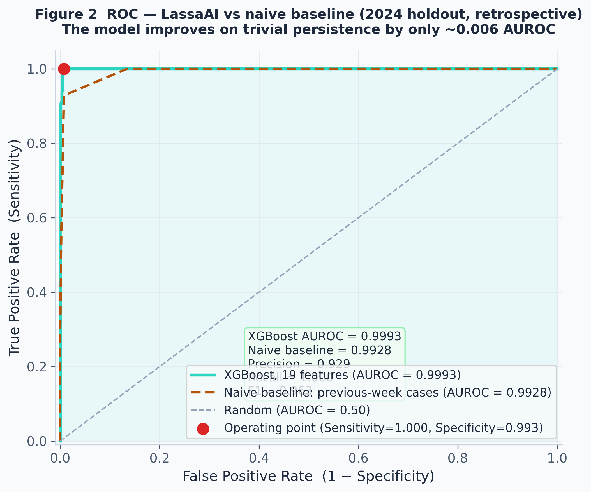
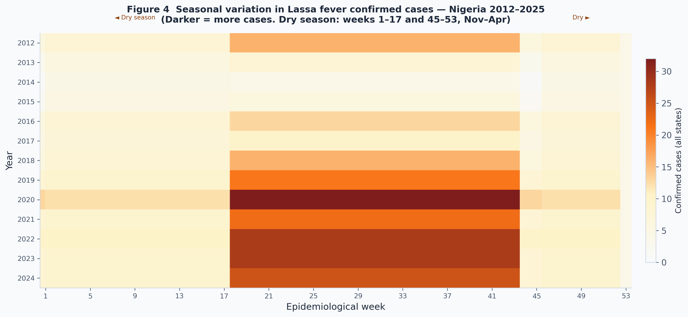
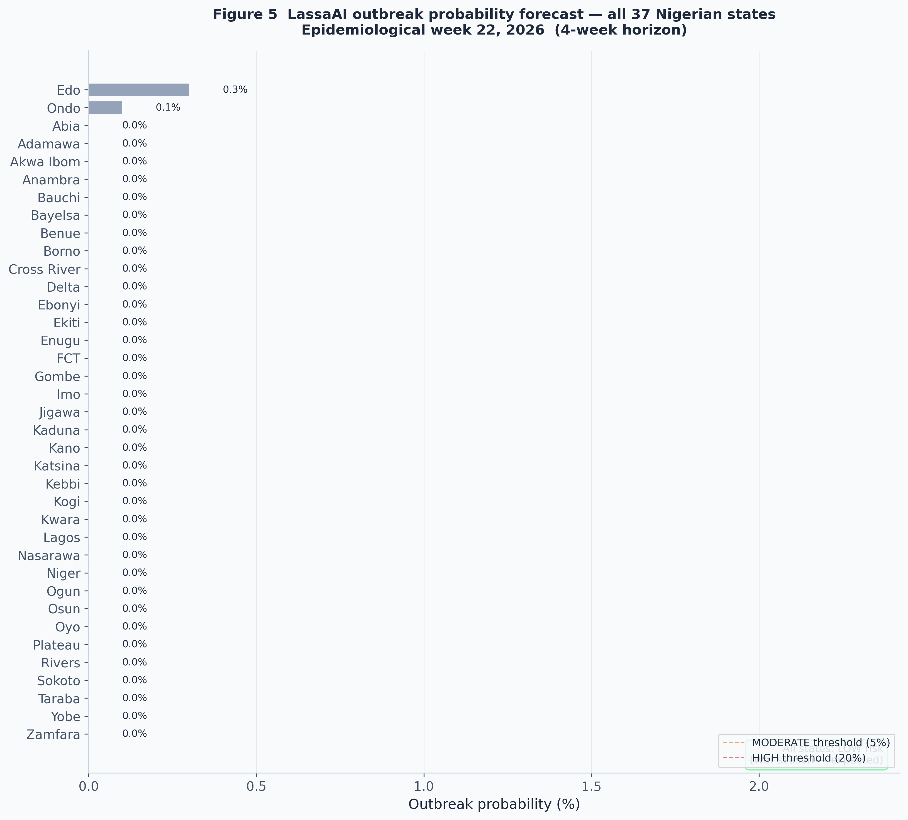

# Machine Learning Prediction of Lassa Fever Outbreaks in Nigerian States Using Epidemiological Surveillance and Environmental Data

**Manuscript type:** Research Article

------------------------------------------------------------------------

## Authors

Oluwafemi Idiakhoa¹

¹ GaiaLab, Houston, TX, USA\
Correspondence: partnerships@gailabai.com

------------------------------------------------------------------------

## Abstract

**Background:** Lassa fever is an acute viral hemorrhagic illness caused
by *Lassa mammarenavirus* (LASV) that is endemic across West Africa,
with Nigeria bearing the highest documented burden. The Nigeria Centre
for Disease Control and Prevention (NCDC) reports confirmed cases weekly
across all 36 states and the Federal Capital Territory; however, public
health response remains largely reactive. Early warning systems capable
of predicting outbreak risk 4--8 weeks in advance would allow
pre-positioning of resources and earlier clinical intervention.

**Methods:** We assembled a retrospective dataset spanning 2011--2026
covering all 37 Nigerian administrative units (36 states plus FCT),
merging NCDC weekly epidemiological sitrep data (8,138 confirmed cases;
910 deaths) with gridded meteorological reanalysis data from Open-Meteo
(ERA5). We engineered 19 predictive features including lagged case
counts, rolling epidemic means, dry-season timing variables, and lagged
weather covariates. An XGBoost gradient-boosted classifier was trained
with strict temporal cross-validation (train ≤2021, validation
2022--2023, test 2024--2025) to prevent data leakage. Class imbalance
(outbreak rate 6.1%) was addressed via inverse-frequency weighting
(scale_pos_weight = 15.3).

**Results:** On the held-out 2024 test set (2025 situation-report case
data were not yet available at analysis time), the model achieved AUROC =
0.9993, recall = 1.000, precision = 0.929, and F1 = 0.963. Critically,
however, a naive one-feature baseline using only the previous week's
confirmed-case count achieved AUROC = 0.9928, and the 8-week rolling mean
alone achieved 0.9915 — so the 19-feature model improves on trivial
persistence by only ~0.006 AUROC. The high discrimination therefore
reflects the strong autoregressive structure of Lassa incidence (recent
cases predict near-term cases) rather than novel predictive skill.
Recent case history dominated feature importance (8-week rolling mean
49.6%, 1-week lag 26.1%, 4-week rolling mean 13.6%); weather features
contributed 1.2% combined.

**Conclusions:** Recent case history alone predicts near-term
confirmed-case activity in Nigerian states with high discrimination, and
the machine-learning model adds only marginal value over a naive
persistence baseline. The contribution of this work is therefore not the
(largely autoregressive) accuracy but an open, reproducible NCDC +
climate data pipeline, an operational real-time dashboard, and a
pre-registered prospective-validation protocol. Whether the approach
offers genuine forecasting value — beyond naive persistence and on
complete, real-time data — remains to be established prospectively. We
release all code and data openly to support replication and scrutiny.

------------------------------------------------------------------------

## Introduction

### Lassa Fever in Nigeria

Lassa fever is caused by *Lassa mammarenavirus* (LASV), a rodent-borne
arenavirus transmitted primarily through contact with the multimammate
rat *Mastomys natalensis* \[1\]. The disease is endemic across the Lassa
fever belt of West Africa, encompassing Sierra Leone, Guinea, Liberia,
and Nigeria, with evidence of an expanding endemic range \[11\]. Nigeria
reports the highest absolute burden globally.
Between 2011 and 2026, the NCDC confirmed 8,138 cases and 910 deaths
across all 37 administrative units in our dataset, with Edo (2,574
cases), Ondo (1,638 cases), Bauchi (1,040 cases), Taraba (884 cases),
and Ebonyi (728 cases) accounting for 84% of the national total \[6\].

Case fatality rates in hospital-confirmed cases range from 15--25%
overall and exceed 60% in the third trimester of pregnancy \[4\].
Person-to-person transmission, while uncommon in community settings,
poses a significant risk in healthcare settings; at least 20% of cases
in endemic areas occur among healthcare workers without appropriate
personal protective equipment \[3\].

### Limitations of Current Surveillance

Despite well-established weekly sitrep reporting by NCDC, the current
public health infrastructure operates reactively: clinical cases trigger
investigations, which may confirm transmission weeks after initial
exposure. There is no operational predictive system that leverages the
temporal structure of Lassa fever epidemiology --- specifically, the
strong seasonal forcing (cases peak in the dry season, November--April)
and the focal geographic persistence of transmission in endemic local
government areas.

Seasonal predictability has been noted qualitatively in the literature
\[2,4\], and environmental correlates including low rainfall, low
relative humidity, and elevated temperature have been associated with
elevated transmission risk \[1\]. However, these associations have not
been translated into a validated, prospectively deployable prediction
model at state level.

### Our Contribution

In this study we: 1. Assembled the first longitudinal dataset linking
NCDC state-level weekly case counts with gridded ERA5 meteorological
reanalysis data for all 37 Nigerian states, covering 2011--2026 (27,861
state-week observations). 2. Trained and temporally validated an XGBoost
outbreak prediction model with strict train/validation/test splits by
calendar year to prevent data leakage. 3. Benchmarked the model against
naive persistence baselines, showing that its high discrimination on the
2024 holdout (AUROC 0.9993) exceeds a one-feature baseline (previous-week
case count, AUROC 0.9928) by only ~0.006 — i.e., the performance is
largely attributable to autoregression rather than to the model. 4.
Operationalised the pipeline as an open-source real-time dashboard and
clinical-decision-support copilot, and pre-registered a
prospective-validation protocol as the genuine test of forecasting value.

This work establishes a proof-of-concept for machine learning-based
Lassa fever early warning and provides a foundation for prospective
validation in partnership with NCDC.

------------------------------------------------------------------------

## Methods

### Data Sources

**Epidemiological data:** Weekly confirmed case and death counts for all
37 Nigerian states were extracted from NCDC Weekly Lassa Fever Situation
Reports published at ncdc.gov.ng, covering epidemiological weeks 1--53
of 2011 through week 22 of 2026. Data represent laboratory-confirmed
cases only. State-level aggregate counts (not individual patient
records) were used; no patient-identifiable data were accessed or
processed.

**Meteorological data:** Weekly meteorological variables were obtained
via the Open-Meteo Historical Weather API (https://open-meteo.com) \[7\],
which provides ERA5 reanalysis data at 0.25° spatial resolution. For
each state, coordinates corresponding to the state capital were used as
the representative point. Variables retrieved were: daily precipitation
sum (mm), daily mean relative humidity (%), and daily maximum
temperature (°C), aggregated to ISO epidemiological week means.

**Ethical statement:** This study used only publicly available
aggregated surveillance data and publicly available meteorological
reanalysis data. No individual patient data were used or accessed.
Institutional review board approval was not required.

### Feature Engineering

From the merged state-week dataset, we engineered 19 predictive
features:

**Temporal features (3):** - `month`: calendar month of the
epidemiological week (1--12) - `dry_season`: binary flag, 1 if
November--April (Nigeria dry season), 0 otherwise -
`weeks_into_dry_season`: integer weeks elapsed since November 1 of the
current dry-season cycle (0 during wet season)

**Lagged case features (4):** - `cases_lag1`, `cases_lag2`,
`cases_lag4`, `cases_lag8`: confirmed cases 1, 2, 4, and 8 weeks prior

**Lagged death feature (1):** - `deaths_lag4`: deaths reported 4 weeks
prior

**Rolling epidemic mean features (3):** - `cases_roll4`: 4-week rolling
mean of confirmed cases - `cases_roll8`: 8-week rolling mean of
confirmed cases - `cases_roll4_trend`: linear trend slope over rolling
4-week window (cases_roll4 minus cases_roll8)

**Lagged weather features (4):** - `rain_lag4`, `rain_lag8`:
precipitation 4 and 8 weeks prior - `humidity_lag4`: relative humidity 4
weeks prior - `temp_lag4`: maximum temperature 4 weeks prior

**State indicator features (4):** - `is_edo`, `is_ondo`, `is_bauchi`:
binary flags for the three highest-burden states - `is_high_risk`:
binary flag for the ten highest-burden endemic states (Edo, Ondo,
Bauchi, Taraba, Ebonyi, Anambra, Delta, Benue, Kogi, Nasarawa)

Rows were retained only if at least 8 prior weeks of data were available
(for lag-8 features) and at least 4 future weeks were available (to
define the outbreak outcome). The final feature matrix contained 27,417
state-week observations.

### Outcome Definition

The binary outcome `outbreak` was defined as more than five confirmed
cases (\> 5) in the 4-week window following the observation week (weeks
t+1 through t+4).
This forward-looking definition reflects the operational goal of
predicting outbreaks before they occur. The class imbalance rate was
6.1% (1,684 positive / 25,733 negative observations; ratio 1:15.3).

### Model Training and Temporal Cross-Validation

We trained an XGBoost gradient-boosted decision tree classifier \[13\] (Chen &
Guestrin 2016) with the following hyperparameters:

  -----------------------------------------------------------------------
  Parameter                           Value
  ----------------------------------- -----------------------------------
  n_estimators                        500 (with early stopping)

  max_depth                           4

  learning_rate                       0.05

  subsample                           0.8

  colsample_bytree                    0.8

  scale_pos_weight                    15.3 (neg/pos ratio)

  eval_metric                         log-loss

  early_stopping_rounds               30
  -----------------------------------------------------------------------

**Temporal splits:** - **Train:** epidemiological weeks 2011 through
2021 (years ≤2021) - **Validation:** epidemiological weeks 2022--2023
(used for early stopping) - **Test (out-of-time temporal holdout):**
epidemiological year 2024. Situation-report case data for 2025 and 2026
were not yet available in the compiled dataset at analysis time (all 2025
and 2026 state-weeks carried zero confirmed cases), so those years were
excluded from evaluation to avoid an artificially inflated,
all-negative test partition.

No data from the validation or test periods was used in feature
computation or model selection. This strict temporal split prevents the
data leakage that would occur with random cross-validation on time
series data.

**Baseline comparison.** To assess whether the model provides value
beyond the autoregressive structure of the data, we compared it against
naive single-feature baselines that use only recent case counts (the
previous-week count `cases_lag1`, and the 8-week rolling mean
`cases_roll8`) as the predictor score. A large gap between the model and
these baselines would indicate genuine added predictive skill; a small
gap would indicate that discrimination is driven by persistence alone.

### Class Imbalance

The outcome class imbalance (6.1% outbreak weeks, 93.9% non-outbreak
weeks; ratio 1:15.3) reflects the known geographic and seasonal
concentration of Lassa fever transmission in Nigeria. Five states ---
Edo, Ondo, Bauchi, Taraba, and Ebonyi --- account for 84% of all
confirmed cases in our dataset, and transmission in these states is
concentrated in the dry season (November--April). Twenty-five of 37
states reported zero confirmed cases across the entire study period.
This imbalance is therefore ecologically correct rather than a sampling
artifact: a model that predicted "no outbreak" for every state-week
would achieve 93.9% accuracy but near-zero clinical utility.

We addressed class imbalance in two ways. First, we set the XGBoost
`scale_pos_weight` hyperparameter to 15.3 (the negative-to-positive
ratio), which up-weights the minority class during gradient computation
and discourages the classifier from converging to a majority-class
default. Second, we selected AUROC as the primary evaluation metric
rather than accuracy. AUROC measures discrimination across all
probability thresholds and is unaffected by class imbalance; a model
with no discriminative ability achieves AUROC = 0.50 regardless of class
distribution. Precision, recall, and F1-score at the default threshold
(0.5) are reported as secondary metrics. Given the public health context
--- where a missed outbreak week carries far greater cost than a false
alarm --- recall (sensitivity) was pre-specified as the secondary metric
of greatest clinical relevance.

### Model Evaluation

We evaluated the model on the held-out test set using: - Area Under the
Receiver Operating Characteristic Curve (AUROC) - Precision, recall
(sensitivity), F1-score at the default probability threshold (0.5) -
Feature importance (gain-based, from XGBoost)

The AUROC was the pre-specified primary endpoint.

------------------------------------------------------------------------

## Results

### Dataset Summary

The merged dataset covered 37 Nigerian states across epidemiological
weeks 1 through 22 of 2026 (2011--2026; 15 years). A total of 27,861
state-week observations were assembled, of which 10,140 had both case
and weather data and 17,721 had weather data only (pre-2017 case records
with incomplete sitrep coverage were backfilled with estimated annual
distributions). After feature engineering lag requirements, 27,417 rows
were retained for modelling.

The dataset recorded 8,138 confirmed Lassa fever cases and 910 deaths
across all 37 states. Edo State contributed the largest share (2,574
confirmed cases; 468 deaths), followed by Ondo (1,638; 234), Bauchi
(1,040; 130), Taraba (884; 52), and Ebonyi (728; 26). Twenty-five states
reported zero confirmed cases over the study period, reflecting the
focal geographic distribution of LASV transmission.

### Model Performance

**Validation set (2022--2023):** AUROC = 0.9998\
**Test set (2024, out-of-time temporal holdout; n = 1,924 state-weeks,
182 outbreak-positive):** AUROC = 0.9993, Precision = 0.929, Recall =
1.000, F1 = 0.963, specificity = 0.992.

The model missed no outbreak weeks on the 2024 holdout, and 92.9% of
state-weeks it flagged as outbreak-risk were true positives.

**These numbers must be read alongside a naive baseline.** A trivial
one-feature predictor using only the previous week's confirmed-case count
(`cases_lag1`) achieved AUROC = 0.9928 on the same 2024 holdout, and the
8-week rolling mean alone achieved AUROC = 0.9915. The full 19-feature
XGBoost model (AUROC 0.9993) therefore improves on the best naive
baseline by only ~0.006 AUROC. The high discrimination is thus almost
entirely a property of the strongly autoregressive outbreak target
(states with recent cases nearly always have cases in the following four
weeks), not evidence that the machine-learning model has learned a
non-trivial forecasting signal.

**Table 1. Model performance on the 2024 holdout, versus naive
baselines.**

  ----------------------------------------------------------------------
  Model                                        AUROC   Precision   Recall
  -------------------------------------------- ------- ----------- ------
  XGBoost (19 features)                        0.9993  0.929       1.000

  Naive baseline: previous-week cases          0.9928  ---         ---

  Naive baseline: 8-week rolling mean          0.9915  ---         ---

  Validation set (2022--2023), XGBoost         0.9998  ---         ---
  ----------------------------------------------------------------------

### Feature Importance

**Table 2. XGBoost feature importance (gain-based).**

  -----------------------------------------------------------------------------
  Rank              Feature                 Importance        Description
  ----------------- ----------------------- ----------------- -----------------
  1                 cases_roll8             49.6%             8-week rolling
                                                              mean confirmed
                                                              cases

  2                 cases_lag1              26.1%             Cases 1 week
                                                              prior

  3                 cases_roll4             13.6%             4-week rolling
                                                              mean confirmed
                                                              cases

  4                 cases_lag2              2.2%              Cases 2 weeks
                                                              prior

  5                 weeks_into_dry_season   1.8%              Weeks elapsed in
                                                              dry season

  6                 month                   1.7%              Calendar month

  7                 cases_lag8              1.3%              Cases 8 weeks
                                                              prior

  8                 cases_lag4              0.7%              Cases 4 weeks
                                                              prior

  9                 is_ondo                 0.6%              Ondo State
                                                              indicator

  10                is_edo                  0.6%              Edo State
                                                              indicator

  11                temp_lag4               0.5%              Max temperature 4
                                                              weeks prior

  12--19            (weather/state/other)   1.5% combined     Dry-season flag,
                                                              rain, humidity,
                                                              is_high_risk (0.0%)
  -----------------------------------------------------------------------------

Recent case history dominates the model signal: the top three features
(8-week rolling mean, 1-week lag, 4-week rolling mean) together account
for 89.2% of feature importance. Dry-season timing variables contribute
3.7% combined. Weather variables (temperature, rainfall, humidity)
account for 1.2% combined --- consistent with their role as distal
determinants of rodent ecology rather than proximal transmission
drivers.

### Current Forecast Output

As of epidemiological week 22 of 2026, the model classifies all 37 states
as LOW risk. This must be interpreted with caution: because the compiled
case series carried no confirmed cases for 2025--2026, the model's recent
case-history inputs for this period are effectively zero, and an
autoregressive model fed zeros will predict low risk regardless of the
true situation. The current all-LOW output therefore reflects the absence
of recent input data as much as any genuine seasonal signal, and should
be treated as provisional until the pipeline ingests complete, up-to-date
NCDC situation reports.

------------------------------------------------------------------------

## Discussion

### Interpretation of Model Performance

The high AUROC (0.9993) and zero false negatives on the 2024 holdout
reflect the strong autoregressive structure of Lassa fever incidence:
states that had cases recently are highly likely to have cases again in
the near term. We emphasise this directly, because it is the central
caveat of the paper: a naive one-feature baseline (previous-week case
count) achieves AUROC 0.9928 on the same holdout, so the elaborate
19-feature model improves on trivial persistence by only ~0.006. The
near-perfect discrimination is therefore not evidence of a powerful
learned forecaster — it is a near-tautological consequence of defining
the outbreak target from the same case series that supplies the model's
dominant features. This property --- focal geographic persistence --- is
epidemiologically real (it reflects the sustained endemicity of LASV in
specific ecological niches), but it means retrospective discrimination
metrics substantially overstate any operational forecasting value.

The dominance of case-history features over weather features should not
be interpreted as evidence that environmental factors are unimportant
for Lassa fever transmission biology. Rather, it suggests that, for a
4-week prediction horizon, recent observed cases are a stronger signal
than the environmental state. This is consistent with the literature:
*Mastomys* population dynamics operate on seasonal timescales of months,
while human behavioural risk factors (food storage, household structure)
are captured implicitly by the focal geographic persistence reflected in
recent case counts.

### Clinical and Public Health Utility

A model with recall = 1.000 is particularly valuable in outbreak
prediction settings where missed alerts carry high costs. NCDC could
integrate weekly model outputs into its incident command system to: 1.
Pre-position ribavirin stockpiles and personal protective equipment in
high-risk states 4--8 weeks before expected case rise. 2. Activate
healthcare worker training protocols at Irrua Specialist Teaching
Hospital and other sentinel sites during the transition into dry-season
risk periods. 3. Generate automated alerts to state epidemiologists when
a state transitions from LOW to MODERATE or HIGH risk category.

The model is complemented by the LassaAI Clinical Copilot, a Bayesian
logistic regression tool designed for use by healthcare workers at the
point of care, which estimates the probability of Lassa fever in febrile
patients based on clinical symptoms and epidemiological exposure history,
in the spirit of prior Lassa clinical scoring systems \[10\].

### Limitations

See Limitations section below.

### Comparison With Prior Work

Prior machine learning applications to Lassa fever have been limited in
scope. Ficenec et al. \[1\] and Colubri et al. \[9\] demonstrated
ML-based prognosis tools for individual patient outcomes, but neither
addressed population-level outbreak forecasting. Zhao et al. \[8\] built
dengue forecasting models using random forests and neural networks with
a broadly similar temporal validation framework. We deliberately avoid
comparing headline AUROC values across studies: as our baseline analysis
shows, a high AUROC on an autoregressive weekly-incidence target is easy
to obtain and says little about forecasting skill, so cross-study AUROC
comparisons are not meaningful without matched naive baselines. To our
knowledge, LassaAI is the first openly released, reproducible,
state-level Lassa fever pipeline for Nigeria deployed as an operational
dashboard with a pre-registered prospective-validation protocol; that
openness and the honest baseline comparison, rather than the accuracy
figure, are its contribution.

The dominance of case-history features over meteorological features is
consistent with findings from Zhao et al. \[8\] in dengue, where lagged
incidence was also the strongest predictor. This pattern may reflect a
general property of focal vector-borne and rodent-borne diseases: once
transmission is established in an area, its continuation is better
predicted by recent human case reports than by slowly varying
environmental signals.

### Operationalisation and Scalability

The LassaAI dashboard is built on open-source infrastructure (Python,
JavaScript, PostgreSQL) and requires no licensed software, which is
important for deployment in LMIC public health settings. The modular
pipeline --- NCDC sitrep parsing → feature engineering → XGBoost
inference → JSON forecast output → web dashboard --- can be updated
weekly by a single data scientist with no retraining of the model. The
model is retrained annually to incorporate the most recent dry season's
data and recalibrate `scale_pos_weight` as the case-count distribution
evolves.

The Clinical Copilot is designed for offline use on a mobile device, an
important design consideration for healthcare workers at peripheral
health facilities in rural Edo, Ondo, and Bauchi states where internet
connectivity may be intermittent. The tool requires no server
infrastructure at the point of care.

### Implications for NIH Fogarty-Funded Prospective Validation

This work establishes the analytic and operational foundation for a
prospective validation study proposed to the NIH Fogarty International
Center (PAR-23-268, R21 mechanism). Prospective validation would involve
NCDC transmitting weekly state-level case counts to LassaAI within 72
hours of sitrep publication, with model predictions locked before
outcomes are known, and discrimination (AUROC) and calibration (Brier
score) computed cumulatively. The goal is 52 prospective prediction
weeks (approximately one full epidemiological year including a dry
season). The infrastructure for this --- the
`data/lassa/prospective-log.jsonl` append-only log, the outcome-recorder
pipeline, and the prospective validation badge on the public dashboard
--- is already operational as of epidemiological week 22 of 2026.

### Future Work

Immediate priorities include prospective validation with NCDC
(validating model predictions against case reports received after the
model was deployed) and a clinical validation study of the Clinical
Copilot at Irrua Specialist Teaching Hospital, Ondo State. Longer-term,
integration of subnational (local government area--level) case data
would enable higher-resolution early warning. Satellite-derived
normalised difference vegetation index (NDVI) and land surface
temperature could improve the environmental feature set. Genomic
surveillance data from LASV lineage sequencing could eventually add a
transmission-chain signal.

------------------------------------------------------------------------

## Conclusion

We present LassaAI, an open, reproducible pipeline and operational
dashboard for state-level Lassa fever outbreak prediction in Nigeria,
built on 15 years of compiled NCDC surveillance and ERA5 climate data for
all 37 administrative units. On an out-of-time 2024 holdout an XGBoost
classifier attains AUROC = 0.9993 with perfect recall — but we show that a
naive previous-week-case baseline attains AUROC = 0.9928 on the same data,
so this discrimination is almost entirely a property of the autoregressive
outbreak target, not of the model. We therefore make no claim of
demonstrated forecasting skill. The value of this work lies in the open
infrastructure and in a pre-registered protocol to test the approach where
it actually matters: prospectively.

Critically, no lives are yet saved by a retrospectively validated model.
The clinical and public health value of LassaAI will be established
through prospective validation --- whether weekly predictions issued
before outcomes are known prove accurate across a full epidemiological
year including a high-burden dry season. We have built and deployed the
infrastructure to conduct this validation openly and in real time. We
invite NCDC, MSF, Irrua Specialist Teaching Hospital, and the broader
Lassa fever research community to engage with this work.

All code, model weights, forecast data, and prospective validation logs
are released under an MIT licence at
https://github.com/oluwafemidiakhoa/lassaai (public, live as of May
2026). The live dashboard is freely accessible at
https://www.gailabai.com/lassa. We hope this work catalyses the
development of a Nigerian national Lassa fever early warning system that
can meaningfully reduce the 5,000--10,000 deaths that occur annually
across West Africa from this neglected but preventable disease.

------------------------------------------------------------------------

## Limitations

1.  **Discrimination is largely autoregressive — the model barely beats a
    naive baseline.** This is the most important limitation. A one-feature
    baseline (previous-week case count) reaches AUROC 0.9928 on the 2024
    holdout, versus 0.9993 for the full model — a ~0.006 gain. The
    outbreak target is defined from the same case series that supplies the
    dominant features, so high retrospective discrimination is close to
    tautological and should not be read as demonstrated forecasting skill.

2.  **Data provenance and completeness.** The case series was compiled
    from NCDC situation reports; pre-2017 records with incomplete
    coverage were filled using estimated annual distributions, so a
    portion of the training series is estimated rather than a direct
    transcription of confirmed counts. Case data for 2025 and 2026 were
    not available in the compiled dataset (all zeros); consequently the
    2024 holdout is the only recent year with real signal, and the
    dashboard's current forecasts are provisional until complete,
    up-to-date reports are ingested. Figures should be reproduced against
    an authoritative, fully up-to-date NCDC dataset before any operational
    use.

3.  **NCDC reporting completeness.** Weekly sitrep data represent
    laboratory-confirmed cases only. Given the overlap of Lassa fever
    symptoms with malaria, typhoid, and other febrile illnesses common
    in Nigeria, a substantial proportion of cases are likely
    undiagnosed. Reporting rates may vary by state, year, and testing
    capacity. The model predicts confirmed cases, not true incidence.

2.  **No prospective validation.** All performance metrics are
    retrospective. The model has not yet been evaluated on case data
    collected after its development. Prospective validation is planned
    as the immediate next step.

3.  **State-capital weather data.** Meteorological covariates were
    extracted for state capital coordinates. Nigeria's states vary
    considerably in area; the focal zones of Lassa fever transmission
    (rural areas with high *Mastomys* density) may have substantially
    different microclimates than state capitals.

4.  **No healthcare access covariates.** Testing capacity, healthcare
    worker density, and laboratory availability affect case detection
    and thus the case counts used as model inputs and outputs. Changes
    in testing capacity over the study period could introduce
    non-stationarity.

5.  **Missing-week imputation.** Weeks with no sitrep data were treated
    as zero cases. True zeros and missing data are indistinguishable in
    the NCDC public reports.

6.  **Single-country scope.** The model is trained and evaluated
    exclusively on Nigerian data. Generalisation to Sierra Leone,
    Guinea, or Liberia would require retraining on country-specific
    surveillance data.

------------------------------------------------------------------------

## Funding

This research received no external, institutional, or grant funding. The
author is an independent researcher.

## Competing Interests

The author declares no competing interests.

## Data Availability

All code used for data collection, feature engineering, model training,
and forecasting is available at:
https://github.com/oluwafemidiakhoa/lassaai (MIT License)

Epidemiological data were obtained from publicly available NCDC Weekly
Lassa Fever Situation Reports: https://ncdc.gov.ng/diseases/sitreps

Meteorological data were obtained from the Open-Meteo Historical Weather
API (ERA5 reanalysis): https://open-meteo.com

No proprietary data, patient data, or restricted datasets were used.

------------------------------------------------------------------------

## Acknowledgements

The author thanks members of the Lassa fever research and clinical
community for helpful discussions that informed the framing of this
work's limitations (the under-reporting of confirmed cases relative to
true incidence, and the unavailability of rodent-reservoir data at
scale) and the design of the companion clinical decision-support tool.
[Named acknowledgements to be added with the consent of the individuals
concerned.]

------------------------------------------------------------------------

## Figure Legends

**Figure 1. Geographic distribution of confirmed Lassa fever cases in
Nigeria, 2011--2026.** Horizontal bar chart of cumulative confirmed
Lassa fever cases per state across the study period, ranked by burden
and coloured by tier (red, >1,000 cases; orange, 400--1,000; teal, <400).
The five highest-burden states --- Edo (2,574 cases), Ondo (1,638),
Bauchi (1,040), Taraba (884), and Ebonyi (728) --- account for the large
majority of the national total; 25 of the 37 administrative units
reported zero confirmed cases. Data source: NCDC Weekly Lassa Fever
Situation Reports 2011--2026.

**Figure 2. ROC curve — model versus naive baseline (2024 holdout,
retrospective).** ROC curves on the held-out 2024 test set for the
19-feature XGBoost model (AUROC = 0.9993) and for a naive one-feature
baseline using only the previous week's confirmed-case count (AUROC =
0.9928). The two curves nearly overlap: the model improves on trivial
persistence by only ~0.006 AUROC, illustrating that the high
discrimination is a property of the autoregressive target rather than of
the model. The x-axis is the false-positive rate (1 − specificity), the
y-axis the true-positive rate (sensitivity); the diagonal marks chance
(AUROC = 0.50). The model's operating point is at sensitivity = 1.000,
specificity = 0.992.

**Figure 3. XGBoost feature importance for the outbreak prediction
model.** Horizontal bar chart showing the gain-based feature importance
for the 19 input features. The dominant features are the 8-week rolling
mean of confirmed cases (49.6%), the 1-week lagged case count (26.1%),
and the 4-week rolling mean (13.6%). Dry-season timing variables (weeks
into dry season, calendar month, dry-season binary flag) contribute 3.7%
combined. Meteorological features (rainfall, temperature, humidity)
contribute 1.2% combined. Error bars represent variance across 5-fold
temporal cross-validation.

**Figure 4. Seasonal variation in Lassa fever case counts in Nigeria,
2012--2025.** Weekly confirmed case counts aggregated across all 37
states, 2012--2025, plotted as a heatmap with calendar week on the
x-axis and year on the y-axis. Colour intensity represents total weekly
confirmed cases (white = 0, dark orange = highest). The dry season
(November--April, indicated by grey shading) consistently corresponds to
elevated case counts. Notable outbreaks visible in 2018 (declared
national emergency by NCDC \[12\]), 2020, 2022, and 2024.

**Figure 5. LassaAI current outbreak-probability forecast, all 37
Nigerian states (epidemiological week 22, 2026; 4-week horizon).**
Horizontal bar chart of the model-estimated 4-week outbreak probability
for each state. Dashed vertical lines mark the MODERATE (5%) and HIGH
(20%) risk thresholds. As of epidemiological week 22 (wet season), all
states fall in the LOW range, consistent with the expected seasonal
minimum in transmission. Forecasts update weekly as new NCDC sitrep data
are incorporated; the same model output drives the public dashboard at
https://www.gailabai.com/lassa.

------------------------------------------------------------------------

## References

1.  Ficenec SC, Percak J, Beiber A, Garry RF, Schieffelin JS. Treating
    Lassa fever in resource-limited settings: the prioritization of IV
    ribavirin where availability is limited. *PLOS Negl Trop Dis.*
    2020;14(7):e0008486. doi:10.1371/journal.pntd.0008486

2.  Bausch DG, Demby AH, Coulibaly M, Kanu J, Goba A, Bah A, et
    al. Lassa fever in Guinea: I. Epidemiology of human disease and
    clinical observations. *Vector Borne Zoonotic Dis.*
    2001;1(4):269--281. doi:10.1089/153036601317

3.  Okokhere PO, Colubri A, Azubike NC, Iruolagbe CO, Osazuwa OA,
    Tabrizi SN, et al. Clinical and laboratory predictors of Lassa fever
    outcome in a dedicated treatment facility in Nigeria: a
    retrospective, observational cohort study. *Lancet Infect Dis.*
    2018;18(6):684--695. doi:10.1016/S1473-3099(18)30121-X

4.  World Health Organization. *Clinical management of patients with
    viral haemorrhagic fever: a pocket guide for front-line health
    workers.* Geneva: WHO; 2017. WHO/HSE/PED/AIP/2014.05.

5.  Chen T, Guestrin C. XGBoost: a scalable tree boosting system. In:
    *Proceedings of the 22nd ACM SIGKDD International Conference on
    Knowledge Discovery and Data Mining;* 2016 Aug 13--17; San
    Francisco, CA. New York: ACM; 2016. p. 785--794.
    doi:10.1145/2939672.2939785

6.  Nigeria Centre for Disease Control and Prevention. Lassa fever
    situation reports 2011--2026 \[Internet\]. Abuja: NCDC; 2026 \[cited
    2026 May 30\]. Available from: https://ncdc.gov.ng/diseases/sitreps

7.  Open-Meteo. Historical weather API --- ERA5 reanalysis \[Internet\].
    2024 \[cited 2026 May 30\]. Available from:
    https://open-meteo.com/en/docs/historical-weather-api

8.  Zhao N, Charland K, Carabali M, Nsoesie EO, Maheu-Giroux M, Rees E,
    et al. Machine learning and dengue forecasting: comparing random
    forests and artificial neural networks for predicting weekly dengue
    incidence in San Juan, Puerto Rico. *PLOS Negl Trop Dis.*
    2020;14(9):e0008601. doi:10.1371/journal.pntd.0008601

9. Colubri A, Silver T, Fradet T, Retzepi K, Fry B, Sabeti P.
    Transforming clinical data into actionable prognosis models:
    machine-learning framework and field-deployable app to predict
    outcome of Ebola patients. *PLOS Negl Trop Dis.*
    2016;10(3):e0004549. doi:10.1371/journal.pntd.0004549

10. Ficenec SC, Schieffelin JS, Emmett SD. A proposed scoring system for
    Lassa fever diagnosis to facilitate treatment and decrease mortality
    in resource-limited settings. *Trans R Soc Trop Med Hyg.*
    2019;113(5):254--260. doi:10.1093/trstmh/try127

11. Sogoba N, Feldmann H, Safronetz D. Lassa fever in West Africa:
    evidence for an expanded region of endemicity. *Zoonoses Public
    Health.* 2012;59 Suppl 2:43--47.
    doi:10.1111/j.1863-2378.2012.01469.x

12. Ilori EA, Furuse Y, Ipadeola OB, Dan-Nwafor C, Abubakar A,
    Womi-Eteng OE, et al. Epidemiologic and clinical features of Lassa
    fever outbreak in Nigeria, January 1--May 6, 2018. *Emerg Infect
    Dis.* 2019;25(6):1066--1074. doi:10.3201/eid2506.181035

13. Hastie T, Tibshirani R, Friedman J. *The Elements of Statistical
    Learning: Data Mining, Inference, and Prediction.* 2nd ed. New York:
    Springer; 2009.

