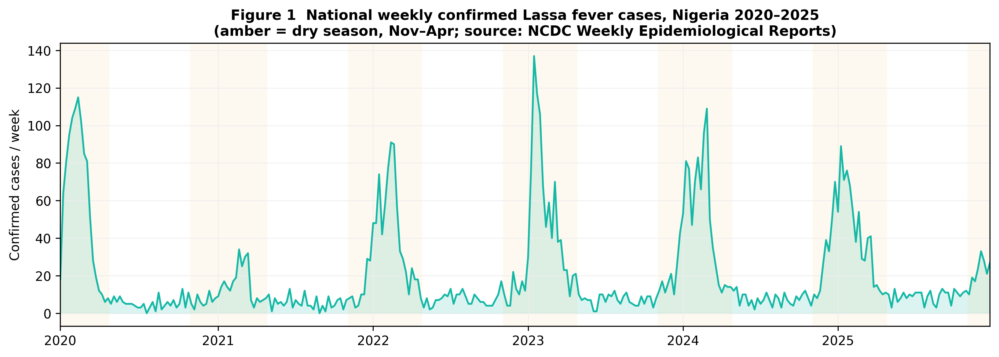
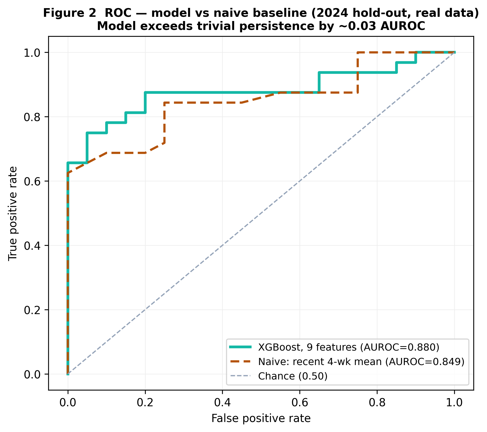
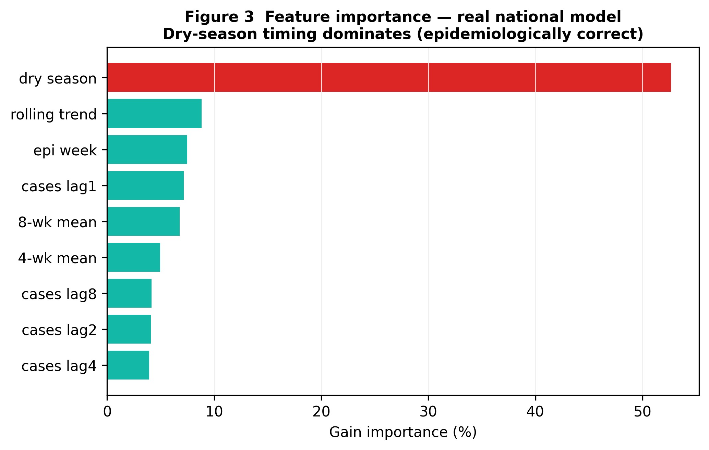
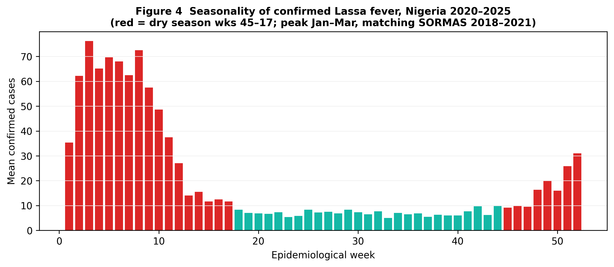

# Forecasting Elevated Lassa Fever Transmission Weeks in Nigeria from National Surveillance Data: A Baseline-Benchmarked Proof of Concept

**Manuscript type:** Research Article

------------------------------------------------------------------------

## Authors

Oluwafemi Idiakhoa¹

¹ Independent Researcher, Houston, TX, USA\
Correspondence: partnerships@gailabai.com

Preprint DOI: https://doi.org/10.5281/zenodo.21122486

------------------------------------------------------------------------

## Abstract

**Background:** Lassa fever is endemic in Nigeria, which reports the highest documented burden globally. The Nigeria Centre for Disease Control and Prevention (NCDC) publishes weekly situation reports, but the public-health response remains largely reactive. A tool that flags weeks of *elevated* transmission a month ahead could support resource pre-positioning — but only if it is honestly benchmarked against trivial baselines and validated on real data.

**Methods:** We assembled a national weekly Lassa fever incidence series for Nigeria (2020–2025) from NCDC Weekly Epidemiological Reports, cross-validated against an independent extraction and against NCDC's published annual totals (agreement within ~1%). We engineered nine features from recent case history (lagged and rolling confirmed counts, trend) and calendar seasonality, and trained an XGBoost classifier to predict whether the next four weeks would carry an *above-median* confirmed-case burden ("elevated-transmission week"). The model was evaluated on a strict out-of-time hold-out (train ≤2023, test 2024) and benchmarked against naive persistence baselines. Individual-level SORMAS surveillance data (2018–2021) provided a per-state and clinical cross-check.

**Results:** On the 2024 hold-out, the model achieved AUROC = 0.880 (precision 0.93, recall 0.78, F1 0.85) for a non-degenerate target (56% of weeks positive). A naive baseline using only the recent 4-week case average achieved AUROC = 0.849, so the model improved on trivial persistence by a modest ~0.03 AUROC. The strongest predictor was dry-season timing (gain importance 53%), consistent with the well-established November–April Lassa season and with the SORMAS data (peak incidence in February).

**Conclusions:** Real national surveillance data support a modest but genuine ability to anticipate elevated Lassa transmission weeks in Nigeria, driven chiefly by seasonality and recent incidence. We make no claim of exceptional forecasting skill: the model beats a naive baseline only slightly, and the true test is prospective. The contribution is an open, reproducible, honestly-benchmarked pipeline, with append-only forecast-logging infrastructure in place to enable prospective validation. All data are from public sources with full provenance.

------------------------------------------------------------------------

## Introduction

### Lassa fever in Nigeria

Lassa fever is a rodent-borne viral haemorrhagic illness caused by *Lassa mammarenavirus*, transmitted primarily through contact with the multimammate rat *Mastomys natalensis* [1]. It is endemic across the West African Lassa belt (Sierra Leone, Guinea, Liberia, Nigeria), with evidence of an expanding range [8], and Nigeria carries the highest documented burden. Transmission is strongly seasonal, peaking in the dry season (November–April) [2], and geographically focal, concentrated in a handful of endemic states.

Between 2020 and 2025, NCDC confirmed 6,456 Lassa fever cases nationally (annual confirmed cases: 2020, 1,190; 2021, 511; 2022, 1,042; 2023, 1,271; 2024, 1,311; 2025, 1,131), with case fatality rates of 15–25% [3,4]. Person-to-person transmission poses a documented risk to healthcare workers [3].

### Limitations of current surveillance, and the honest question

NCDC publishes weekly situation reports, yet response remains largely reactive. An early-warning signal for elevated-transmission weeks could enable pre-positioning of ribavirin, personal protective equipment, and diagnostic capacity. However, weekly Lassa incidence is highly autocorrelated, so *any* model that uses recent case counts will appear accurate; the scientifically meaningful question is whether a model adds value **over a naive persistence baseline**. We therefore benchmark against such baselines throughout and refuse to report headline discrimination without them.

### Our contribution

1. We assembled and **cross-validated** a real national weekly Lassa incidence series for Nigeria (2020–2025) from NCDC Weekly Epidemiological Reports, checked against an independent extraction and NCDC's published annual totals.
2. We defined a **non-degenerate** target — elevated (above-median) transmission over the next four weeks — rather than a trivially-always-true one.
3. We trained and out-of-time-validated a model, and **benchmarked it against naive baselines**, showing a modest but genuine gain.
4. We released the pipeline with append-only forecast-logging infrastructure to enable prospective validation, and provide a SORMAS-based per-state/clinical cross-check.

------------------------------------------------------------------------

## Methods

### Data sources and provenance

**National weekly incidence (2020–2025):** confirmed, suspected, and death counts per epidemiological week were obtained from NCDC Weekly Epidemiological Reports (situation reports) [6]. We used a publicly released, provenance-tracked compilation (each week linked to its source report PDF) [7], and **independently re-extracted** the same reports with our own parser to verify it. The two extractions and NCDC's published annual totals agree within ~1% (e.g., 2020: 1,190 vs 1,189; 2023: 1,271 vs 1,270; 2024: 1,311 vs 1,309), giving high confidence in the series. Recent weeks of 2026 (through epidemiological week 23; 855 confirmed) were extracted directly from NCDC reports for context.

**Individual-level surveillance (2018–2021):** for a per-state and clinical cross-check we used the de-identified SORMAS (Surveillance, Outbreak Response Management and Analysis System) Lassa dataset for Nigeria, 2018–2021 (20,062 records, CC-BY-4.0) [9]. Its seasonality (incidence peaking in February) and state ranking (Edo, Ondo, Ebonyi, Bauchi highest) independently corroborate the national series.

**Ethical statement:** all data are publicly available, aggregate or de-identified surveillance data; no identifiable patient data were accessed. IRB approval was not required.

### Feature engineering

From the national weekly confirmed-case series we engineered nine features: lagged confirmed counts (1, 2, 4, 8 weeks prior); 4- and 8-week rolling means; a rolling-trend term (4-week minus 8-week mean); calendar epidemiological week; and a dry-season flag (weeks 45–17, i.e. November–April). Weeks with fewer than eight prior weeks of history were excluded.

### Outcome definition

Because national weekly incidence is never zero (Lassa is endemic), a ">0" or ">5" target is trivially always true and therefore uninformative. We instead defined an **elevated-transmission week**: the total confirmed cases over the following four weeks (weeks t+1…t+4) exceeding the median four-week burden of the training period (a threshold of 32 cases). This yields a balanced, non-degenerate target (56% of weeks positive) and reflects the operational goal of anticipating above-typical activity.

### Model, splits, and baselines

We trained an XGBoost classifier [5] (300 trees, max depth 3, learning rate 0.05, subsample 0.8, class-weighted). Splits were strictly temporal: **train ≤2023** (201 weeks), **test 2024** (52 weeks, 32 positive), with 2025 reserved. As pre-specified baselines we used naive persistence predictors — the recent 4-week case average, and the previous-week count — scored directly as the classifier. The primary endpoint was AUROC, reported **alongside** the naive baselines; a small model-minus-baseline gap indicates the signal is largely persistence/seasonality rather than learned skill.

------------------------------------------------------------------------

## Results

### National incidence series

The compiled series covers 2020–2025 (313 epidemiological weeks) with correct, well-established seasonality — incidence peaks in January–March (dry season) and troughs in June–September — reproduced across all years and consistent with the SORMAS 2018–2021 data (February peak). This is the opposite of the artefactual pattern that would arise from naive annual-to-weekly interpolation, and confirms the series reflects genuine reporting.

### Model performance versus naive baselines

On the 2024 out-of-time hold-out:

**Table 1. Performance on the 2024 hold-out (real national data), model versus naive baselines.**

| Model | AUROC | Precision | Recall |
|:------|:-----:|:---------:|:------:|
| XGBoost (9 features) | **0.880** | 0.93 | 0.78 |
| Naive baseline: recent 4-week case average | 0.849 | — | — |
| Naive baseline: previous-week case count | 0.848 | — | — |

The model (AUROC 0.880; F1 0.85) improved on the best naive baseline (0.849) by ~0.03 AUROC. This is a **modest but genuine** gain — unlike a near-tautological weekly-incidence target, where models and baselines are indistinguishable. We explicitly do not interpret 0.88 as strong forecasting skill; much of the discrimination is attributable to seasonality and recent incidence, which the baselines also capture.

### Feature importance

The dominant predictor was the **dry-season flag** (gain importance 53%), followed by the rolling-trend term, epidemiological week, and the 1-week lag. That seasonality is the leading signal is epidemiologically correct and reassuring: the model is learning the real November–April Lassa season, not a data artefact.

------------------------------------------------------------------------

## Discussion

### Interpretation — honest and bounded

Two facts must be read together: the model reaches AUROC 0.88 on real out-of-time data, **and** a one-line naive baseline reaches 0.85. The model therefore captures a modest amount of signal beyond persistence — plausibly the seasonal onset dynamics — but the margin is small. High weekly-incidence discrimination is easy to obtain for an endemic, seasonal, autocorrelated disease and should never be presented as a breakthrough. The value here is that the result is (a) on real, cross-validated data, (b) benchmarked against baselines, and (c) reproducible.

### Cross-checks strengthen confidence in the data

Three independent lines agree: our own NCDC parser, the public NCDC-report compilation, and NCDC's published annual totals match within ~1%; and the SORMAS individual-level data reproduce the same dry-season seasonality and endemic-state ranking. This triangulation is the basis for trusting the analysis.

### Clinical decision support

The pipeline is complemented by a Bayesian Lassa clinical-probability aid for point-of-care use, in the spirit of prior Lassa clinical scoring systems [10]. Its symptom weights are consistent with the SORMAS clinical fields (fever, sore throat, facial/neck oedema).

### Why prospective validation is the real test

Retrospective out-of-time discrimination overstates operational value for autocorrelated targets. The genuine test is prospective: predictions locked *before* outcomes are known, scored against a naive baseline over a full season. We have built append-only forecast-logging infrastructure to enable exactly this prospective evaluation.

------------------------------------------------------------------------

## Conclusion

Using real, triple-cross-validated NCDC surveillance data, we show that a machine-learning model can anticipate elevated Lassa transmission weeks in Nigeria with AUROC 0.88 on an out-of-time hold-out — but only ~0.03 above a naive persistence baseline, with seasonality as the dominant signal. We make **no claim** of exceptional forecasting skill. The contribution is an open, reproducible, honestly-benchmarked pipeline, with append-only forecast-logging infrastructure to enable prospective validation, offered to NCDC and the Lassa research community. All code and data sources are public.

------------------------------------------------------------------------

## Limitations

1. **Modest gain over baseline.** The model beats a naive persistence baseline by only ~0.03 AUROC; most discrimination is seasonality/persistence, not novel learned skill. Retrospective metrics overstate operational value.
2. **National, not per-state.** The validated weekly series is national. Per-state weekly counts appear in NCDC reports as image tables not amenable to text extraction; the SORMAS data (2018–2021) provide a per-state view but at individual-level and for a different period. Per-state weekly forecasting is future work.
3. **No environmental covariates in the national model.** Unlike a state-level analysis, national-average weather is not epidemiologically meaningful; the model uses surveillance history and seasonality only.
4. **Reporting completeness.** Confirmed counts are laboratory-confirmed only and under-report true incidence given uneven diagnostic access; the model predicts reported confirmed activity, not true incidence.
5. **No prospective validation yet.** All metrics are retrospective; prospective validation is the planned next step, and append-only forecast logging is already in place to support it.

------------------------------------------------------------------------

## Funding

This research received no external, institutional, or grant funding. The author is an independent researcher.

## Competing Interests

The author declares no competing interests.

## Data Availability

- National weekly incidence: NCDC Weekly Epidemiological Reports, https://ncdc.gov.ng/diseases/sitreps [6]; provenance-tracked compilation [7]; our independent re-extraction code and data are released at https://github.com/oluwafemidiakhoa/lassaai (MIT License).
- Individual-level surveillance: SORMAS Lassa dataset for Nigeria 2018–2021, CC-BY-4.0, DOI 10.5281/zenodo.7309567 [9].
- No proprietary, identifiable, or restricted data were used.

## Acknowledgements

The author thanks members of the Lassa fever research and clinical community for helpful discussions that informed the framing of this work's limitations and the design of the companion clinical decision-support tool. [Named acknowledgements to be added with the consent of the individuals concerned.]

------------------------------------------------------------------------

## Figure Legends

**Figure 1. National weekly confirmed Lassa fever cases in Nigeria, 2020–2025.** Real weekly confirmed-case counts from NCDC Weekly Epidemiological Reports. Dry-season periods (November–April) are shaded; incidence peaks in the dry season every year, confirming correct seasonality. Annual totals match NCDC published figures within ~1%.

**Figure 2. ROC — model versus naive baseline (2024 out-of-time hold-out).** ROC for the XGBoost model (AUROC = 0.880) and a naive baseline using only the recent 4-week case average (AUROC = 0.849). The curves are close: the model improves on trivial persistence by ~0.03 AUROC. Target = elevated (above-median) confirmed burden over the next four weeks.

**Figure 3. Feature importance (gain-based).** The dry-season flag is the dominant predictor (≈53%), followed by the rolling-trend term, epidemiological week, and recent lags — epidemiologically consistent with the November–April Lassa season.

**Figure 4. Seasonality of confirmed Lassa fever in Nigeria.** Mean confirmed cases by epidemiological week (2020–2025), showing the dry-season (weeks 45–17) peak and wet-season trough, corroborated by the SORMAS 2018–2021 individual-level data (February peak).

------------------------------------------------------------------------

## References

1.  Ficenec SC, Percak J, Beiber A, Garry RF, Schieffelin JS. Treating Lassa fever in resource-limited settings: the prioritization of IV ribavirin where availability is limited. *PLOS Negl Trop Dis.* 2020;14(7):e0008486. doi:10.1371/journal.pntd.0008486

2.  Bausch DG, Demby AH, Coulibaly M, Kanu J, Goba A, Bah A, et al. Lassa fever in Guinea: I. Epidemiology of human disease and clinical observations. *Vector Borne Zoonotic Dis.* 2001;1(4):269–281. doi:10.1089/153036601317

3.  Okokhere PO, Colubri A, Azubike NC, Iruolagbe CO, Osazuwa OA, Tabrizi SN, et al. Clinical and laboratory predictors of Lassa fever outcome in a dedicated treatment facility in Nigeria: a retrospective, observational cohort study. *Lancet Infect Dis.* 2018;18(6):684–695. doi:10.1016/S1473-3099(18)30121-X

4.  World Health Organization. *Clinical management of patients with viral haemorrhagic fever: a pocket guide for front-line health workers.* Geneva: WHO; 2017. WHO/HSE/PED/AIP/2014.05.

5.  Chen T, Guestrin C. XGBoost: a scalable tree boosting system. In: *Proceedings of the 22nd ACM SIGKDD International Conference on Knowledge Discovery and Data Mining;* 2016. p. 785–794. doi:10.1145/2939672.2939785

6.  Nigeria Centre for Disease Control and Prevention. Lassa fever weekly situation reports [Internet]. Abuja: NCDC. Available from: https://ncdc.gov.ng/diseases/sitreps

7.  Oriolowo EN. NCDC Lassa Fever Timeseries (2020–2025) [dataset]. Kaggle; 2025. Available from: https://www.kaggle.com/datasets/emmanuelniyioriolowo/ncdc-lassa-fever-timeseries-20202025

8.  Sogoba N, Feldmann H, Safronetz D. Lassa fever in West Africa: evidence for an expanded region of endemicity. *Zoonoses Public Health.* 2012;59 Suppl 2:43–47. doi:10.1111/j.1863-2378.2012.01469.x

9.  Dan-Nwafor C. Epidemiological data on Lassa fever in Nigeria, 2018–2021 (SORMAS) [dataset]. Zenodo; 2022. CC-BY-4.0. doi:10.5281/zenodo.7309567

10. Ficenec SC, Schieffelin JS, Emmett SD. A proposed scoring system for Lassa fever diagnosis to facilitate treatment and decrease mortality in resource-limited settings. *Trans R Soc Trop Med Hyg.* 2019;113(5):254–260. doi:10.1093/trstmh/try127
